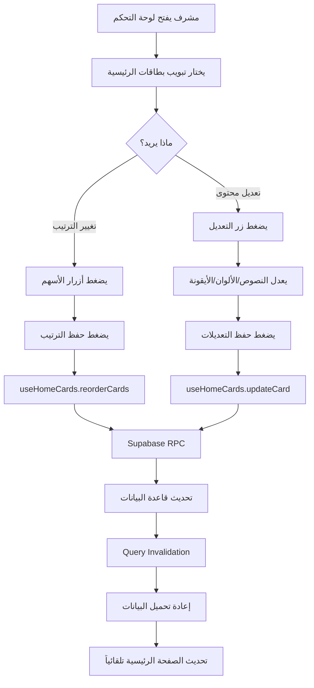

# نظام إدارة بطاقات الصفحة الرئيسية
## Home Cards Management System

## نظرة عامة

تم إنشاء نظام متكامل لإدارة بطاقات التنقل في الصفحة الرئيسية من لوحة التحكم، مما يتيح للمشرفين:

✅ **إعادة ترتيب البطاقات** بأزرار بسيطة (أعلى/أسفل)  
✅ **تعديل النصوص** (العنوان والوصف)  
✅ **اختيار الأيقونات** من مكتبة lucide-react  
✅ **تغيير الألوان** (خلفية البطاقة ولون الأيقونة)  
✅ **تحديد المسار** الذي تؤدي إليه البطاقة  
✅ **تحديد متطلبات الدخول** (هل تتطلب تسجيل دخول أم لا)  
✅ **التحديث الفوري** - التغييرات تظهر مباشرة على الصفحة الرئيسية

---

## مكونات النظام

### 1. قاعدة البيانات (Database Schema)

**الملف:** `CREATE_HOME_CARDS_TABLE.sql`

**الجدول:** `home_cards`

```sql
CREATE TABLE home_cards (
  id UUID PRIMARY KEY DEFAULT gen_random_uuid(),
  title TEXT NOT NULL,
  description TEXT NOT NULL,
  icon_name TEXT NOT NULL,
  path TEXT NOT NULL,
  requires_auth BOOLEAN DEFAULT false,
  bg_color TEXT NOT NULL,
  icon_color TEXT NOT NULL,
  display_order INTEGER NOT NULL,
  is_active BOOLEAN DEFAULT true,
  created_at TIMESTAMPTZ DEFAULT now(),
  updated_at TIMESTAMPTZ DEFAULT now()
);
```

**الدوال (Functions):**

1. **get_active_home_cards()** - جلب البطاقات النشطة مرتبة
2. **update_card_order()** - تحديث ترتيب بطاقة واحدة
3. **update_home_card()** - تحديث بيانات بطاقة

**الصلاحيات (RLS):**
- جميع المستخدمين يمكنهم القراءة
- المستخدمون المسجلون يمكنهم التعديل

---

### 2. طبقة البيانات (Data Layer)

**الملف:** `src/hooks/useHomeCards.tsx`

**الوظائف:**

```typescript
const { 
  cards,              // البطاقات المجلوبة من قاعدة البيانات
  isLoading,          // حالة التحميل
  updateCard,         // تحديث بطاقة واحدة
  updateOrder,        // تحديث ترتيب بطاقة
  reorderCards,       // إعادة ترتيب جميع البطاقات دفعة واحدة
  isUpdating          // حالة التحديث
} = useHomeCards();
```

**الميزات:**
- استخدام TanStack Query للتخزين المؤقت
- إشعارات Toast للنجاح والخطأ
- إعادة تحميل البيانات تلقائياً بعد التعديلات

---

### 3. واجهة الإدارة (Admin UI)

**الملف:** `src/components/Dashboard/HomeCardsManagement.tsx`

**المكونات:**

#### أ. قائمة البطاقات
- عرض جميع البطاقات بترتيبها الحالي
- رقم الترتيب لكل بطاقة
- معاينة مباشرة للبطاقة (اللون، الأيقونة، النص)
- عرض المسار ومتطلبات الدخول

#### ب. أزرار الترتيب
```tsx
<Button onClick={() => handleMoveUp(index)}>
  <ChevronUp />  // تحريك للأعلى
</Button>
<Button onClick={() => handleMoveDown(index)}>
  <ChevronDown />  // تحريك للأسفل
</Button>
```

#### ج. زر حفظ الترتيب
```tsx
<Button onClick={handleSaveOrder}>
  <Save /> حفظ الترتيب
</Button>
```

#### د. نموذج التعديل (Dialog)
- **العنوان:** حقل إدخال نصي
- **الوصف:** حقل إدخال نصي
- **المسار:** حقل لإدخال المسار (مثل `/properties`)
- **الأيقونة:** قائمة منسدلة (Search, Building2, PlusCircle, User, Home, MapPin)
- **الألوان:** شبكة من 8 خيارات لونية:
  - أزرق (Blue)
  - بنفسجي (Purple)
  - أخضر (Green)
  - برتقالي (Orange)
  - أحمر (Red)
  - أصفر (Yellow)
  - وردي (Pink)
  - نيلي (Indigo)
- **يتطلب تسجيل دخول:** مفتاح (Switch)

---

### 4. الصفحة الرئيسية (Frontend Integration)

**الملف:** `src/pages/Home.tsx`

**التعديلات:**

#### قبل:
```typescript
const navigationCards = [
  { icon: Search, title: "وين اسكن", ... },
  // بيانات ثابتة (hardcoded)
];
```

#### بعد:
```typescript
import { useHomeCards } from "@/hooks/useHomeCards";

const { cards, isLoading: cardsLoading } = useHomeCards();

const navigationCards = cards?.map(card => ({
  icon: getIconComponent(card.icon_name),
  title: card.title,
  description: card.description,
  path: card.path,
  requiresAuth: card.requires_auth,
  bgColor: card.bg_color,
  iconColor: card.icon_color,
})) || [];
```

**دالة ربط الأيقونات:**
```typescript
const getIconComponent = (iconName: string) => {
  const IconComponent = (Icons as Record<string, any>)[iconName];
  return IconComponent || Icons.Home;
};
```

---

### 5. لوحة التحكم (Dashboard Integration)

**التعديلات على الملفات:**

#### `src/pages/Dashboard.tsx`
```typescript
import { HomeCardsManagement } from "@/components/Dashboard/HomeCardsManagement";

case "home-cards":
  return <HomeCardsManagement />;
```

#### `src/components/Dashboard/DashboardTabs.tsx`
```typescript
{
  id: "home-cards",
  label: "بطاقات الرئيسية",
  icon: LayoutDashboard,
  color: "text-pink-600",
  gradient: "from-pink-500 via-pink-600 to-rose-600",
  hoverGradient: "from-pink-400 to-pink-500",
  shadowColor: "shadow-pink-500/25"
}
```

#### `src/hooks/useDashboardNav.ts`
```typescript
export const DASHBOARD_TABS = [
  'overview',
  'properties',
  // ...
  'home-cards',  // ✅ إضافة التبويب الجديد
  // ...
];
```

---

## خطوات التطبيق

### 1. تطبيق قاعدة البيانات

```bash
# افتح Supabase Dashboard
# اذهب إلى SQL Editor
# انسخ محتوى ملف CREATE_HOME_CARDS_TABLE.sql
# قم بتشغيله
```

### 2. التحقق من التثبيت

```bash
# تأكد من عدم وجود أخطاء في البناء
npm run build

# تأكد من عدم وجود أخطاء في ESLint
npm run lint
```

### 3. الاختبار

1. ✅ افتح التطبيق في المتصفح
2. ✅ سجل الدخول كمشرف
3. ✅ اذهب إلى لوحة التحكم
4. ✅ اختر تبويب "بطاقات الرئيسية"
5. ✅ جرب تغيير ترتيب البطاقات
6. ✅ اضغط "حفظ الترتيب"
7. ✅ ارجع إلى الصفحة الرئيسية - يجب أن يظهر الترتيب الجديد
8. ✅ جرب تعديل بطاقة (العنوان، الوصف، اللون)
9. ✅ احفظ التعديلات
10. ✅ ارجع للصفحة الرئيسية - يجب أن تظهر التعديلات

---

## البيانات الافتراضية

البطاقات الأربعة الافتراضية:

### 1. وين اسكن
- **الأيقونة:** Search
- **المسار:** /map
- **الألوان:** أزرق (bg-blue-50 / bg-blue-500)
- **يتطلب دخول:** لا

### 2. العقارات المتوفرة الآن
- **الأيقونة:** Building2
- **المسار:** /properties
- **الألوان:** بنفسجي (bg-purple-50 / bg-purple-500)
- **يتطلب دخول:** لا

### 3. إضافة عقار جديد
- **الأيقونة:** PlusCircle
- **المسار:** /add-property
- **الألوان:** أخضر (bg-green-50 / bg-green-500)
- **يتطلب دخول:** نعم ✅

### 4. ملفي الشخصي
- **الأيقونة:** User
- **المسار:** /profile
- **الألوان:** برتقالي (bg-orange-50 / bg-orange-500)
- **يتطلب دخول:** نعم ✅

---

## سير العمل (Workflow)



---

## الملفات المضافة/المعدلة

### ملفات جديدة:
- ✅ `CREATE_HOME_CARDS_TABLE.sql` - قاعدة البيانات
- ✅ `src/hooks/useHomeCards.tsx` - Hook لإدارة البيانات
- ✅ `src/components/Dashboard/HomeCardsManagement.tsx` - واجهة الإدارة
- ✅ `APPLY_HOME_CARDS_SYSTEM.sql` - دليل التطبيق
- ✅ `HOME_CARDS_SYSTEM_DOCUMENTATION.md` - هذا الملف

### ملفات معدلة:
- ✅ `src/pages/Home.tsx` - تحويل من بيانات ثابتة إلى ديناميكية
- ✅ `src/pages/Dashboard.tsx` - إضافة case للتبويب الجديد
- ✅ `src/components/Dashboard/DashboardTabs.tsx` - إضافة التبويب
- ✅ `src/hooks/useDashboardNav.ts` - إضافة نوع التبويب

---

## التقنيات المستخدمة

- **React 18** - المكتبة الأساسية
- **TypeScript** - الكتابة القوية
- **TanStack Query** - إدارة حالة الخادم والتخزين المؤقت
- **Supabase** - قاعدة البيانات والـ RPC
- **shadcn/ui** - مكونات الواجهة
- **Lucide React** - الأيقونات
- **Tailwind CSS** - التنسيق

---

## الأمان (Security)

### RLS Policies

```sql
-- القراءة: جميع المستخدمين
CREATE POLICY "Anyone can view active home cards"
ON home_cards FOR SELECT TO public
USING (is_active = true);

-- التعديل: المستخدمون المسجلون فقط
CREATE POLICY "Authenticated users can update cards"
ON home_cards FOR UPDATE TO authenticated
USING (true);

CREATE POLICY "Authenticated users can update order"
ON home_cards FOR UPDATE TO authenticated
USING (true);
```

### SECURITY DEFINER Functions

جميع دوال RPC مضبوطة على `SECURITY DEFINER` مع صلاحيات محددة، مما يضمن:
- ✅ عدم تجاوز RLS
- ✅ تنفيذ آمن للعمليات
- ✅ حماية البيانات

---

## الصيانة والتطوير المستقبلي

### إضافات محتملة:

1. **البطاقات المخصصة:**
   - السماح بإضافة بطاقات جديدة (لا تعديل فقط)
   - زر "إضافة بطاقة جديدة"

2. **Drag & Drop:**
   - استخدام @dnd-kit لسحب وإفلات البطاقات
   - أكثر سهولة من الأزرار

3. **معاينة مباشرة:**
   - نافذة معاينة للتعديلات قبل الحفظ
   - رؤية التغييرات في الوقت الفعلي

4. **التاريخ:**
   - حفظ تاريخ التعديلات
   - إمكانية التراجع (Undo)

5. **البطاقات غير النشطة:**
   - إخفاء البطاقات بدلاً من حذفها
   - زر تبديل (Toggle) للإظهار/الإخفاء

---

## استكشاف الأخطاء (Troubleshooting)

### المشكلة: البطاقات لا تظهر

**الحل:**
```bash
# تحقق من Supabase SQL Editor
SELECT * FROM home_cards WHERE is_active = true ORDER BY display_order;

# إذا كانت فارغة، قم بإعادة تشغيل INSERT statements
```

### المشكلة: التعديلات لا تظهر في الصفحة الرئيسية

**الحل:**
```typescript
// تحقق من Query Invalidation في useHomeCards.tsx
queryClient.invalidateQueries({ queryKey: ['home-cards'] });

// جرب إعادة تحميل الصفحة (Hard Refresh)
Ctrl + Shift + R
```

### المشكلة: أخطاء RLS

**الحل:**
```sql
-- تحقق من Policies
SELECT * FROM pg_policies WHERE tablename = 'home_cards';

-- إعادة تطبيق Policies
DROP POLICY IF EXISTS "policy_name" ON home_cards;
-- ثم إعادة إنشائها
```

---

## الخلاصة

نظام إدارة بطاقات الصفحة الرئيسية يوفر:

✅ **مرونة كاملة** - تعديل كل جانب من جوانب البطاقات  
✅ **سهولة الاستخدام** - واجهة بديهية للمشرفين  
✅ **تحديثات فورية** - التغييرات تظهر مباشرة  
✅ **أمان محكم** - RLS و SECURITY DEFINER  
✅ **توافق كامل** - يعمل مع البنية الحالية بدون تعارضات  
✅ **RTL Support** - دعم كامل للعربية  
✅ **Responsive** - يعمل على جميع الأحجام  

---

**تاريخ الإنشاء:** 2025-01-XX  
**الحالة:** ✅ Complete & Ready for Production  
**المطور:** GitHub Copilot  
**النسخة:** 1.0.0
