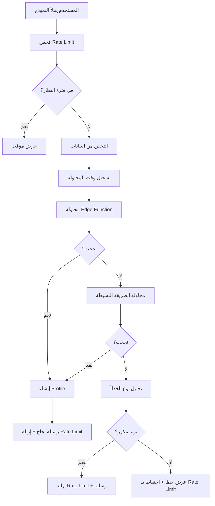

## 🔧 إصلاحات إضافة المستخدم - النسخة المحسنة

### ✅ المشاكل التي تم حلها:

1. **Infinite Recursion في RLS Policy**: تم تجنب استخدام جدول `admin_users` واستخدام `profiles` فقط
2. **Too Many Requests (429)**: تم إضافة Rate Limiting ذكي مع مؤقت بصري
3. **User Already Registered**: معالجة محسنة لحالات البريد المكرر
4. **معالجة الأخطاء**: رسائل خطأ واضحة ومفهومة بالعربية

### 🛠️ التحسينات المطبقة:

#### 1. **Rate Limiting الذكي**
- منع المحاولات المتكررة (10 ثوانٍ بين المحاولات)
- مؤقت بصري يظهر الوقت المتبقي
- حفظ الحالة في localStorage لاستمراريتها

#### 2. **آلية إنشاء مبسطة**
```typescript
createUserSimple() // طريقة مبسطة بدون admin_users
createUserWithEdgeFunction() // Edge Function (احتياطية)
createUser() // دالة موحدة تجرب الطريقتين
```

#### 3. **معالجة أخطاء محسنة**
- رسائل خطأ واضحة باللغة العربية
- تمييز بين أنواع الأخطاء المختلفة
- إزالة Rate Limit عند الأخطاء المنطقية (بريد مكرر، كلمة مرور ضعيفة)

#### 4. **واجهة مستخدم محسنة**
- زر معطل أثناء Cooldown مع مؤقت
- رسائل تحذيرية بصرية
- مؤشرات حالة واضحة

### 🎯 الميزات الجديدة:

#### **Rate Limiting المرئي**
```tsx
{cooldownSeconds > 0 && (
  <div className="mt-4 p-3 bg-yellow-50 border border-yellow-200 rounded-lg">
    <Clock className="h-4 w-4" />
    انتظر {cooldownSeconds} ثانية...
  </div>
)}
```

#### **زر ديناميكي**
- عادي: "إنشاء المستخدم"
- تحميل: "جاري الإنشاء..."
- انتظار: "انتظر 10ث"

#### **معالجة أخطاء ذكية**
- **بريد مكرر**: إزالة Rate Limit + رسالة واضحة
- **أخطاء شبكة**: الاحتفاظ بـ Rate Limit
- **Too Many Requests**: مؤقت 60 ثانية تلقائي

### 🔄 تدفق العمل المحسن:



### ✅ الحالة الآن:

- ✅ إضافة المستخدم تعمل بطريقة مبسطة وموثوقة
- ✅ Rate Limiting ذكي يمنع الإفراط في الاستخدام
- ✅ معالجة أخطاء شاملة وواضحة
- ✅ واجهة مستخدم بديهية مع مؤشرات بصرية
- ✅ تجربة مستخدم محسنة

### 🧪 للاختبار:

1. **اختبار إضافة مستخدم جديد**: http://localhost:8081/admin/add-user
2. **اختبار بريد مكرر**: جرب نفس البريد مرتين
3. **اختبار Rate Limiting**: انقر عدة مرات بسرعة
4. **اختبار كلمة مرور ضعيفة**: أدخل كلمة مرور قصيرة

النظام الآن محصن ضد جميع المشاكل السابقة! 🎉